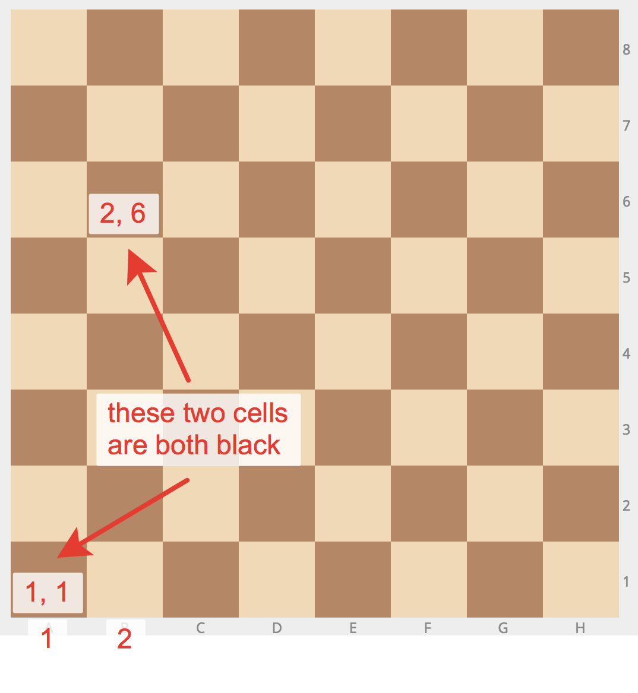

## Chess Board - Black Square

This program determines the color of a square on a chessboard given its coordinates. The chessboard is an 8x8 grid, with columns and rows numbered from 1 to 8. 


Source:  https://snakify.org/

### How It Works

The program receives two integer inputs representing the column and row numbers of a square on the chessboard. It then calculates the color of the square based on these coordinates. The output is "BLACK" if the square is black and "WHITE" if the square is white.

### Input

Users must input two integers: the first for the column number and the second for the row number, both ranging from 1 to 8.

### Output

The program prints "BLACK" if the square at the given coordinates is black, and "WHITE" otherwise.

### Example

```shell
$ python main.py
1
1
BLACK
$ python main.py
2
2
BLACK
$ python main.py
1
2
WHITE
$ python main.py
2
1
WHITE
```

---